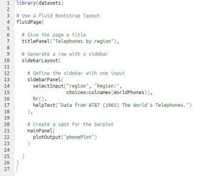
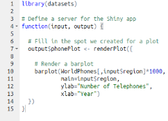
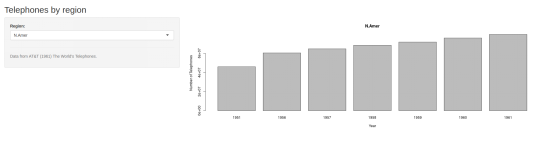

Course Project: Shiny Application and Reproducible Pitch
========================================================
author: Levi Resende
date: August 11th, 2019
autosize: true

Aplication Oerview
========================================================
This application was build using the datasets from R, and shows the evolution of the number of telephones between 1951-1961 in some regions.

Code ui.R and server.R
========================================================

Published on Shiny
========================================================

- Shiny URL: https://leviresende.shinyapps.io/week4/
- GitHub URL: 
